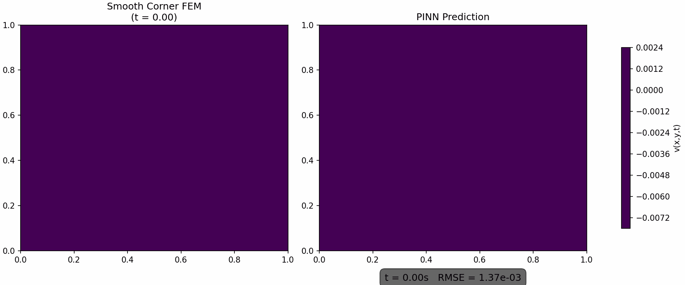

# Master Thesis: Solving the Monodomain Equation with PINNs

This repository contains the code for my master's thesis, which focuses on solving the monodomain equation using Physics-Informed Neural Networks (PINNs) and comparing results to the Finite Element Method (FEM). We use PyTorch for training PINNs, applied to both forward and inverse cardiac electrophysiology problems.

## 📁 Repository Structure

- `data/` – FEM simulation data (from FEniCSx)  
- `utils/` – PINNs and FEM solver classes for the coupled ODE-PDE system  
- `simulations/` – All simulation scripts  
- `results/` – Output data and visualizations  
- `requirements.txt` – Python dependencies  
- `README.md` – This file  
## 🚀 Getting Started

### 1. Clone the Repository

git clone https://github.com/EdvinJarve/master_final.git
cd master_final

### 2. Install Dependencies

We recommend using a virtual environment or conda.

pip install -r requirements.txt

Note: `dolfinx`, `ufl`, `petsc4py`, and `mpi4py` may need to be installed using `conda` or inside a Docker container compatible with FEniCSx. For example:

conda install -c conda-forge fenics-dolfinx petsc4py mpi4py

### 3. Run Simulations

After installing the dependencies, run any of the scripts in the `simulations/` folder to start a simulation. For example

python3 simulations/regular_pinns/analytical_case.py

You can modify the script or choose a different file depending on the case you want to run (e.g., 3D, inverse problem, etc.).

## 🧠 Methodology

- PINNs are implemented in PyTorch and trained using a composite loss function based on the residuals of the monodomain equation and the coupled ODE.
- FEM simulations are performed using FEniCSx to generate high-fidelity reference data for training and benchmarking.
- Both forward simulations (solving for transmembrane potential given known parameters) and inverse problems (recovering unknown parameters from sparse data) are supported.

## 📊 Results

All results — including predicted solutions, losses, error metrics, and plots — are saved in the `results/` directory. These can be used to reproduce the figures and tables in the thesis.

## 🧰 Utilities

The `utils/` directory contains:
- `pinn_solver.py`: The class that defines and trains the PINN.
- `fem_solver.py`: The FEniCSx-based solver for forward FEM simulations of the monodomain equation.
- Additional helper functions and classes.

## 📂 Data

The `data/` folder contains:
- Pre-computed FEM data from FEniCSx used as training and validation input for the PINNs.
- Benchmark datasets for evaluating model performance under varying conditions (noise, sparsity, etc.).

## 💬 Contact

For questions, suggestions, or collaborations, feel free to reach out via GitHub or contact me directly.

### 📽️ Example Output

